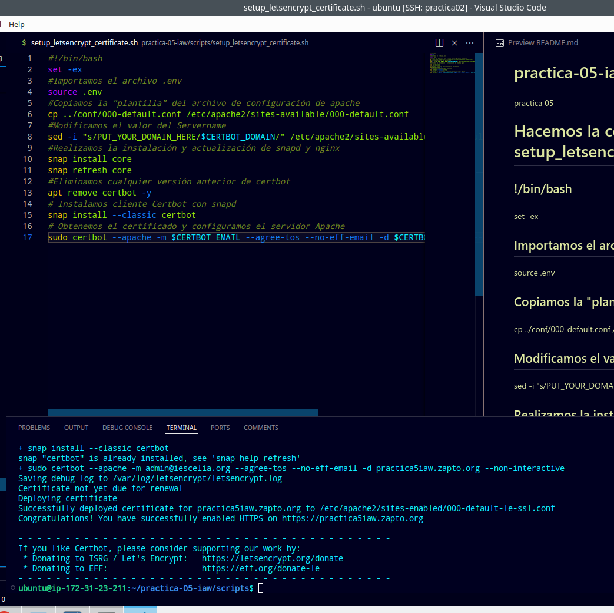

# practica-05-iaw
practica 05
# Hacemos la configuración de setup_letsencrypt_certificate.sh
## !/bin/bash
set -ex
## Importamos el archivo .env
source .env
## Copiamos la "plantilla" del archivo de configuración de apache
cp ../conf/000-default.conf /etc/apache2/sites-available/000-default.conf
## Modificamos el valor del Servername
sed -i "s/PUT_YOUR_DOMAIN_HERE/$CERTBOT_DOMAIN/" /etc/apache2/sites-available/000-default.conf
## Realizamos la instalación y actualización de snapd y nginx
snap install core
snap refresh core
## Eliminamos cualquier versión anterior de certbot
apt remove certbot -y
## Instalamos cliente Certbot con snapd
snap install --classic certbot
## Obtenemos el certificado y configuramos el servidor Apache
sudo certbot --apache -m $CERTBOT_EMAIL --agree-tos --no-eff-email -d $CERTBOT_DOMAIN --non-interactive

